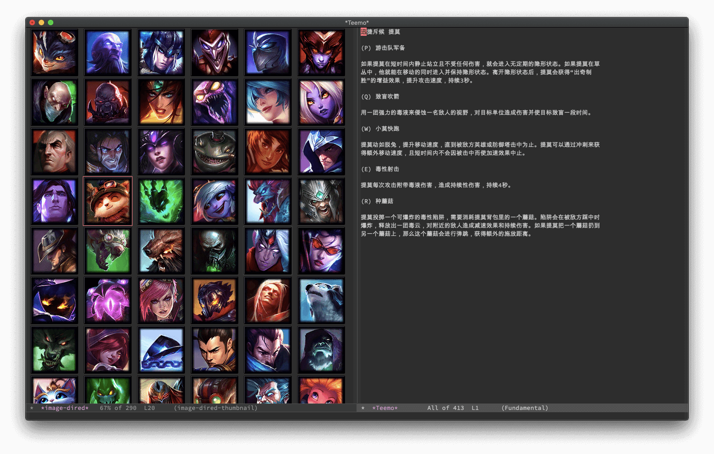

# Browse [Data Dragon](https://developer.riotgames.com/ddragon.html) in Emacs



## Requirement

- Emacs 25.1

## Setup

Download and decompress the ddragon file, then point `ddragon-dir` to it, for example,

``` shell
cd
wget https://ddragon.leagueoflegends.com/cdn/dragontail-10.3.1.tgz
mkdir dragontail-10.3.1
tar xvzf dragontail-10.3.1.tgz -C dragontail-10.3.1
```

``` emacs-lisp
(setq ddragon-dir "~/dragontail-10.3.1/")
```

10.3.1 is the latest version as of today, Feb 13, 2020, you can find out the
latest version on https://ddragon.leagueoflegends.com/api/versions.json e.g.,

``` shell
~/s/ddragon.el $ curl -s https://ddragon.leagueoflegends.com/api/versions.json | jq -r .[0]
10.3.1
~/s/ddragon.el $
```

## Usage

### `M-x ddragon-champion-image-dired`

Show all champions using `image-dired`.

### `M-x ddragon-champion-show-QWER champion-id language-code`

Display abilities (passive and QWER) of a champion.

### `M-x ddragon-champion-show-skins champion-id`

Display all skins of a champion.

### `M-x ddragon-champion-show-tiles champion-id`

Display all tiles of a champion.

### `M-x ddragon-random-random-tiles`

Display N random tiles.

## API

### `(ddragon-champions)`

Return a list of champions IDs.

``` emacs-lisp
(ddragon-champions)
;; => ("Aatrox" "Ahri" "Akali" "Alistar" "Amumu" "Anivia" "Annie" "Aphelios" "Ashe" ...)
```

## Resources

- https://developer.riotgames.com/ddragon.html (Data Dragon API)
- https://na.leagueoflegends.com/en/game-info/champions/ (en_US champions list)
- https://lol.qq.com/data/info-heros.shtml (zh_CN champions list)
- https://lol.garena.tw/game/champion (zh_TW champions list)
